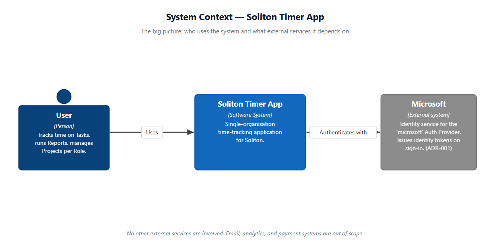
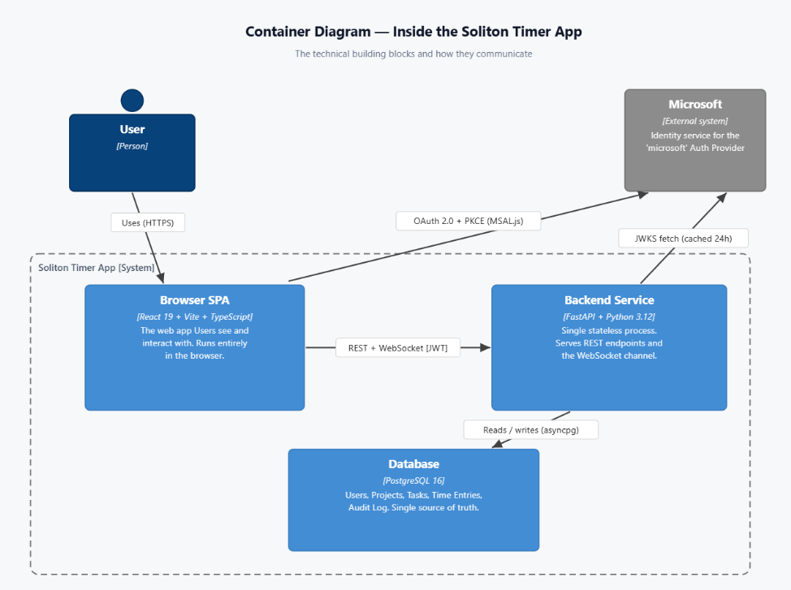
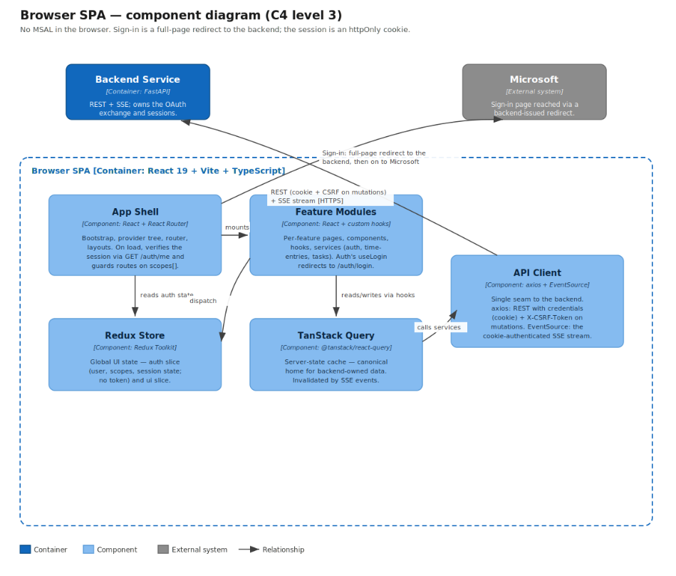

# ADR-004: System Architecture

| Field | Value |
|---|---|
| **Status** | Proposed |
| **Date** | 25-05-2026 |
| **Revised** | 10-06-2026 |
| **Deciders** | Backend + Frontend team |
| **Depends on** | ADR-001 |

---

## Context

The Soliton Timer App is a single-organisation web-based time-tracking tool. It is built as three pieces — a browser SPA, a Python backend service, and a PostgreSQL database — supported by a Redis session store. Users sign in via the **`'microsoft'`** Auth Provider (defined in ADR-001) using a Backend-for-Frontend (BFF) pattern: the backend drives the OAuth exchange as a confidential client and the browser carries only an httpOnly session cookie. Live cross-tab and cross-device updates flow over a Server-Sent Events (SSE) stream.

All domain terms used below — **User**, **Auth Provider**, **Time Entry**, **Running Timer**, **Project**, **Task**, **Audit Log**, **Auth Log** — are defined in ADR-001 and are not redefined here. This document covers what ADR-001 does not: containers, components, technology choices, and communication patterns.

The architecture is documented in three C4 levels — Context (C1), Containers (C2), and Components (C3) — followed by the technology choices, communication patterns, and operational concerns.

---

## System Context (C4 Level 1)

The big picture: who uses the system and what external services it depends on.

| Element | Defined in |
|---|---|
| **User** | ADR-001 — *People & Roles* |
| **Soliton Timer App** | This ADR (the system being documented) |
| **Microsoft** | ADR-001 — *Authentication* (the identity service behind the `'microsoft'` Auth Provider) |

No other external systems are involved. Email gateways, analytics platforms, payment processors, and third-party reporting tools are all out of scope — see ADR-001 *Scope Boundary*.

---

## Containers (C4 Level 2)

The technical building blocks inside the system, and how they communicate.

### Why the Database is inside the system boundary

The C4 model draws the system boundary around things **we own and operate**. Microsoft's identity service is owned and operated by Microsoft, so it sits outside the boundary as an external system. The Database runs on hardware we control, holds data we own, and ships in lockstep with the Backend Service — so it is drawn as a Container inside the boundary, not as an external dependency.

### The three containers

| Container | Stack | What it does |
|---|---|---|
| **Browser SPA** | React 19 + Vite + TypeScript | Renders the UI, holds no token (session is an httpOnly cookie), manages local state, opens an SSE stream for live updates. |
| **Backend Service** | FastAPI + Python 3.12 (Uvicorn) | Drives the OAuth exchange as a confidential client, creates and validates sessions, serves REST endpoints, hosts the SSE channel, writes to the Database and the session store. |
| **Database** | PostgreSQL 16 | Source of truth for all persistent data. Schema in ADR-003. |
| **Session Store** | Redis 7 | Holds server-side sessions and the per-session encrypted Microsoft token cache. Enables instant revocation and idle expiry. |

### Communication channels

| From | To | Channel | Purpose |
|---|---|---|---|
| User | Browser SPA | Browser UI (HTTPS) | The user-facing surface |
| Browser SPA | Backend Service | Full-page redirect to `/auth/login` | Begins sign-in; the backend owns the OAuth flow |
| Backend Service | Microsoft | OAuth 2.0 authorization-code + PKCE (confidential client, MSAL Python) | Sign-in for the `'microsoft'` Auth Provider |
| Browser SPA | Backend Service | HTTPS REST with the `timer_session` httpOnly cookie + `X-CSRF-Token` on mutations; SSE stream on the same origin | Business operations + live updates |
| Backend Service | Microsoft | HTTPS GET to JWKS endpoint, cached 24h; token + refresh exchange | Verify identity tokens and silently refresh the session's Microsoft tokens |
| Backend Service | Session Store | Redis protocol over localhost | Create, validate, refresh, and revoke sessions |
| Backend Service | Database | SQL over asyncpg | Persist and read all state |

### Why a single backend, single database

A single backend process, a single database, and a single Redis instance is right for a single-organisation deployment at this scale. It removes whole classes of distributed-systems problems (cross-service latency, eventual consistency, queue ordering, distributed transactions). The backend holds no in-process session state — sessions live in Redis — so when load demands more than one process, multiple instances can run behind a load balancer reading the shared session store. The session store is the one stateful dependency the BFF model adds versus the earlier stateless-token design; that trade is examined in *Consequences*.

---

## Components (C4 Level 3) — Browser SPA

The Browser SPA container "opened up" — for frontend developers and reviewers who need to know where to add or change code.

| Component | Stack | Role | Lives in |
|---|---|---|---|
| **App Shell** | React + React Router | Bootstrap, provider tree, router, layouts | `src/app/` |
| **Feature Modules** | React + custom hooks | Per-feature pages, components, hooks, services (auth, time-entries, tasks) | `src/features/{feature}/` |
| **Redux Store** | Redux Toolkit | Global UI state — `auth` and `ui` slices | `src/store/slices/` |
| **TanStack Query** | `@tanstack/react-query` | Server-state cache — canonical home for backend-owned data | configured in `src/app/providers/` |
| **API Client** | axios + EventSource | REST transport (cookie-authenticated, CSRF header on mutations) + SSE stream; single seam to the Backend Service | `src/shared/api/`, `src/shared/sse/` |

See **ADR-005** (Frontend Architecture) for the full module map, feature module shape, state placement decision rule, and the SSE sync contract.

### Note: C3 for the Backend Service is pending

The Component diagram for the Backend Service container is **not** in this revision. Any future collaborator should add it as a follow-up. Cross-reference: **ADR-005 — *Real-Time Sync*** describes the contract the Backend container fulfils.

---

## Technology Choices

For each major choice, the alternatives we considered and why the chosen option won.

### Frontend Framework — React 19

| Option | Strengths | Trade-offs | Verdict |
|---|---|---|---|
| **React 19** | Largest UI library ecosystem; first-class TypeScript; Microsoft's official MSAL React library; mature hooks model | Bundle size larger than newer alternatives; doesn't include router, forms, HTTP — must compose | ✓ Chosen |
| Vue 3 | Smaller bundle; gentler learning curve; built-in reactive primitives | Smaller talent pool in our region; smaller accessible-component ecosystem | Rejected: team familiarity with React; Vue training cost dwarfs the bundle-size win |
| Angular | Batteries-included (router, forms, HTTP, DI); strongly opinionated; first-class TypeScript | Heavier runtime; steeper learning curve; we'd fight the framework on parts we want to do differently | Rejected: too prescriptive for V1 scope |
| Svelte / SvelteKit | Smallest runtime (compiles to vanilla JS); cleaner reactive syntax | Smaller ecosystem; no official MSAL library; less mature for enterprise apps | Rejected: MSAL React is the deciding factor |
| Solid | React-like syntax with fine-grained reactivity | Very young ecosystem; no MSAL integration | Rejected: too early to bet on |

**Why it wins:** Microsoft's official MSAL React library removes the most fragile part of the auth implementation. Bundle size is acceptable for an internal app on a corporate network.

### Backend Framework — FastAPI

| Option | Strengths | Trade-offs | Verdict |
|---|---|---|---|
| **FastAPI** | Async-first; auto-generated OpenAPI; Pydantic validation; modern Python 3.10+ | Smaller ecosystem than Django; newer than Flask | ✓ Chosen |
| Django REST Framework | Most mature Python REST framework; admin UI, ORM, auth, migrations; huge ecosystem | Synchronous by default; full-stack assumptions add weight when we only need REST | Rejected: we don't need an admin UI; async is essential for the SSE channel |
| Flask | Minimal core; flexible; very mature | No first-class async; no built-in validation; no automatic API docs | Rejected: FastAPI is "Flask with batteries we want" |
| Litestar | Similar to FastAPI; faster in benchmarks | Smaller community; less documentation | Rejected: ecosystem favours FastAPI |
| Node.js (Express / NestJS) | Same language as frontend; large npm ecosystem | We'd lose Python's data tooling; Pydantic is hard to replicate in JS | Rejected: language unification isn't strong enough |

**Why it wins:** Pydantic validation removes a class of bugs at the API boundary. Auto-generated OpenAPI is the contract by default. Async-native is essential for the SSE channel.

### Database — PostgreSQL 16

| Option | Strengths | Trade-offs | Verdict |
|---|---|---|---|
| **PostgreSQL 16** | ACID + MVCC; mature; first-class JSONB; rich extension ecosystem; managed offerings everywhere | More ops surface than SQLite; slower for tiny single-user workloads | ✓ Chosen |
| MySQL / MariaDB | Equally mature; widely deployed | No JSONB; less strict isolation defaults; weaker historical constraint enforcement | Rejected: Postgres' stricter defaults match our integrity-first stance |
| SQLite | Zero-ops; file-based; most-deployed database in the world | Single-writer model doesn't fit concurrent writes from multiple tabs/devices | Rejected: concurrency model doesn't fit |
| MongoDB | Document model; flexible schema | Domain is highly relational; weaker transactions than Postgres | Rejected: relational fit is wrong |
| CockroachDB | Horizontally scalable; Postgres-wire-compatible | Operational complexity dwarfs the gain at single-org scale | Rejected: over-engineered for our deployment |

**Why it wins:** ADR-003's schema is relational. ACID matters because Audit Log must be a faithful record. Tooling (pgAdmin, pg_dump, WAL-based PITR) is unmatched.

### Authentication Library — MSAL Python (backend, confidential client)

Under the BFF model the OAuth flow runs on the backend, so the authentication library is a server-side dependency, not a browser one. MSAL.js (`@azure/msal-browser` / `@azure/msal-react`) is **removed** from the frontend entirely.

| Option | Strengths | Trade-offs | Verdict |
|---|---|---|---|
| **MSAL Python (`msal`)** | Microsoft's official server-side library; handles the confidential-client authorization-code flow, PKCE, token cache, and silent refresh; first-party support | Backend dependency; ties the backend to Microsoft's identity service (not a problem — that's our IdP) | ✓ Chosen |
| MSAL.js in the browser | Official; mature | Puts the OAuth flow and a token in the browser — the SPA-token model this revision rejects | Rejected: incompatible with BFF |
| Authlib (generic OAuth/OIDC) | Provider-agnostic; well regarded | More code for Microsoft-specifics (tenant validation, refresh semantics) | Rejected: MSAL's Microsoft support is worth the lock-in |
| Custom OAuth | Full control | OAuth + PKCE + refresh has many subtle correctness issues; writing it securely is a project in itself | Rejected: the security-critical parts are exactly the parts not to write yourself |

**Why it wins:** the confidential-client flow, token caching, and silent refresh are exactly the security-critical paths not to hand-write. Running MSAL server-side keeps the client secret and the Microsoft tokens off the browser, which is the central security property of the BFF model.

### Real-time Channel — Server-Sent Events (SSE)

| Option | Strengths | Trade-offs | Verdict |
|---|---|---|---|
| **Server-Sent Events (SSE)** | Server-to-client streaming over plain HTTP; browser auto-reconnect built in; the session cookie authenticates the stream with no extra handshake; passes through HTTP-aware proxies | Server-to-client only (fine — our events are one-way); needs proxy buffering disabled on the route | ✓ Chosen |
| WebSocket | Bidirectional, low-latency; FastAPI native | Bidirectional capability we don't use; stateful per-process; some corporate proxies strip the upgrade; a token-on-the-upgrade auth question SSE avoids | Rejected: the timer channel is one-way, so the extra capability buys nothing and costs proxy and auth complexity |
| Long polling | Works through any HTTP-aware proxy | High latency; high request volume | Rejected: SSE gives streaming without the polling cost |
| Pusher / Ably | Managed; reliability is someone else's problem | Third-party dependency; data flows through a vendor | Rejected: don't want operational logic on a vendor's roadmap |
| GraphQL Subscriptions | Powerful subscription model | We don't use GraphQL elsewhere | Rejected: we're a REST shop |

**Why it wins:** the timer channel is purely server-to-client (start/stop/update/delete hints), so SSE's one-way model is a fit, not a limitation. It rides the existing session cookie for auth — closing the "how does the real-time channel authenticate" question by construction — and works over plain HTTP, so the only operational requirement is disabling proxy buffering on the stream route.

### Supporting Choices

| Choice | Why | Notable alternatives |
|---|---|---|
| **Vite** (build) | Native ESM dev server; sub-second startup; very fast HMR | Webpack (slow), Parcel (smaller community), Turbopack (still beta) |
| **TanStack React Query** (server state) | Industry-leading cache, refetch, mutation handling; mutation hooks fit our optimistic-update patterns | SWR (smaller), RTK Query (Redux-coupled), Apollo (GraphQL focus) |
| **Redux Toolkit** (client state) | Small explicit store for theme, auth, UI flags; mature devtools; team familiarity | Zustand (smaller ecosystem), Jotai/Recoil (atomic but unfamiliar), Context API (no devtools) |
| **MUI v6 + SCSS modules** (styling) | Accessible components by default; SCSS modules for scope-isolated overrides | Tailwind (team prefers semantic SCSS), Chakra (smaller), Mantine (smaller ecosystem) |
| **Vitest** (testing) | Vite-native; Jest-compatible API; ESM-first; fast | Jest (slower with ESM), Mocha (less batteries-included) |
| **Pydantic v2** (validation) | Bundled with FastAPI; Rust-rewritten core; strict typing | Marshmallow (older API), attrs + cattrs (more manual) |

---

## Communication Patterns

Three patterns cover everything.

### REST over HTTPS

All CRUD operations and Reports. Authentication via the `timer_session` httpOnly cookie, resolved server-side to a Redis session. Mutating requests (POST/PUT/PATCH/DELETE) additionally carry an `X-CSRF-Token` header checked against the session-bound CSRF token. Pydantic validates request bodies; invalid shapes return `422` with field-level errors. Authentication failures return `401`; authorisation failures return `403`; CSRF failures return `403` with `csrf_mismatch`. Consistent error envelope `{ "error_code": "<code>", "message": "<human-readable>" }` so the frontend can map codes to UI without parsing free text.

### SSE over HTTPS

A single Server-Sent Events stream per User, opened by the SPA after `/auth/me` confirms the session. The stream's GET carries the `timer_session` cookie automatically — no token in the URL, no separate handshake auth. The backend pushes typed events — Running Timer started, Time Entry stopped, updated, deleted — and the frontend invalidates the affected TanStack Query keys (see ADR-005 *Real-Time Sync*). The client uses REST for all state changes; the stream is server-to-client only. The browser's `EventSource` reconnects automatically; on reconnect the client refetches core queries to recover any state changes during the gap. If the session is revoked or expires while the stream is open, the backend closes the stream and the client's reconnect attempt resolves to a `401`, forcing sign-out. Proxy buffering must be disabled on the stream route (`X-Accel-Buffering: no`).

### JWKS fetch

The Backend Service fetches Microsoft's public signing keys once on cold start, then caches them for 24 hours. The keys validate the identity token returned during the backend's authorization-code exchange. A signature verification failure forces one immediate re-fetch in case keys rotated; if the second attempt fails too the exchange is rejected. If the JWKS endpoint is unreachable on cold start, the very first SSO login fails — but once cached, the backend is independent of Microsoft for verification for 24 hours.

---

## Authentication

ADR-001 defines two **Auth Provider** values: `'microsoft'` (SSO, primary, UI-exposed) and `'local'` (bcrypt password fallback, hidden — not implemented in V1 per ADR-006). This section describes the wire-level implementation under the Backend-for-Frontend (BFF) model.

The backend drives the OAuth authorization-code flow against Microsoft as a **confidential client**. The browser never participates in the OAuth exchange and never holds a token. On successful sign-in the backend creates a **server-side session in Redis** and sets an opaque `timer_session` httpOnly cookie; a companion JS-readable `timer_csrf` cookie carries the CSRF token. Per-request authorisation resolves the cookie to the session, loads the User's role and scopes, and checks scope membership.

The session stores an encrypted cache of the User's Microsoft access and refresh tokens. When the Microsoft access token nears expiry the backend silently refreshes it; if Microsoft refuses the refresh, the session is revoked. Sessions expire after **30 minutes idle** (sliding) or **8 hours absolute**, whichever comes first — both environment-configurable. The full wire contract is in `CONTRACT-backend-auth.md`.

Revocation is immediate. Logout, User archival, and administrative session kill all delete the server-side session, so a compromised or stale session ends on its next request rather than persisting to a token expiry. This is the central improvement over the earlier stateless-token model, which had no mid-session revocation. The trade is one new stateful dependency (Redis) and a CSRF surface; both are examined in *Consequences*.

---

## Logging and Audit

ADR-001 defines three persisted log tables — **Audit Log** (`audit_logs`), **Auth Log** (`auth_logs`), and **Error Log** (`error_logs`). All three are append-only, retained indefinitely, and gated by their respective `*:read` scopes.

Audit Log and Auth Log rows are written in the **same database transaction** as the state change they describe. A failure to write the audit row fails the operation. This is the integrity guarantee that makes the audit trail trustworthy.

---

## Deployment Topology

| Concern | V1 choice | Why |
|---|---|---|
| Hosting | Single host (VM or container) running Uvicorn + PostgreSQL + Redis | Single-organisation scale; no multi-tier needed in V1 |
| TLS termination & origin | Reverse proxy (nginx or Caddy) fronting both the SPA and the API on one origin, API under `/api` | Standard pattern; same-origin is effectively required for the session cookie to behave under `SameSite=Lax`. Proxy buffering must be disabled on the SSE route. |
| Backups | `pg_dump` daily + WAL archival; Redis AOF persistence enabled | Industry standard; AOF lets sessions survive a Redis restart (otherwise a restart logs everyone out — acceptable but should be a conscious choice) |
| Secrets | Environment variables read at process start | `DB credentials`, `REDIS_URL`, `MICROSOFT_CLIENT_ID`, `MICROSOFT_CLIENT_SECRET`, `MICROSOFT_TENANT_ID`, `SESSION_ENCRYPTION_KEY`. The confidential-client **secret lives only backend-side** — it is never shipped to the browser. `JWT_SECRET` is retired. |
| Session store hardening | Redis bound to localhost, `AUTH` required, never reachable off-box | Sessions and encrypted Microsoft tokens live here; it is now a top-tier asset, unlike the stateless-token design which had no session store to attack |
| Monitoring | Health check endpoint + log aggregation | Sufficient for V1; metrics dashboard is a future enhancement. Auth `code`/`state` values must never be logged |
| Scaling path | Multiple backend instances behind a load balancer, sharing the Redis session store | Sessions are external to the process, so no sticky sessions needed for auth; SSE fan-out across instances would use Redis pub/sub |

---

## Failure Modes

The User-visible behaviour of each major dependency failure.

| What fails | What the User sees | Recovery |
|---|---|---|
| Microsoft is unavailable | New sign-ins fail; existing sessions keep working, and silent Microsoft refresh fails only once the cached access token needs renewing | No local fallback in V1 (ADR-006); recovery is Microsoft's availability returning |
| PostgreSQL is unavailable | Backend returns 5xx on any DB-touching request; SPA shows a connection-error banner | DB restart; backend reconnects automatically; SSE events resume after reconnect |
| Redis is unavailable | Session validation fails; users are treated as signed-out and redirected to sign-in; new sign-ins cannot create a session | Redis restart; with AOF enabled, existing sessions survive; otherwise users re-sign-in |
| Backend Service crashes | Connection-error banner; `EventSource` reconnects automatically | Process supervisor (systemd, Docker restart policy) brings the service back up |
| Browser loses network | TanStack Query marks queries stale; `EventSource` reconnects automatically | Automatic when the network returns |
| Session expires or is revoked mid-session | Next request returns `401`; user redirected to `/login?error=session_expired`; any open SSE stream is closed | User signs in again — usually a single silent click if the Microsoft session is still alive |
| User's role is changed | New permissions apply on the User's **next request** — role and scopes are loaded per request, not baked into a token | Effective immediately; no wait for token expiry |
| User is archived | All of that User's sessions are revoked; the next request fails | Immediate; commit-then-revoke leaves a sub-second window before the session key is deleted, after which the per-request `status` check rejects regardless |

No silent data loss is possible. Every write either succeeds and is acknowledged, or fails and surfaces an error. The Audit Log makes every change traceable.

---

## Consequences

### Positive

- **Small, understandable system.** Three containers plus a session store, one external dependency. New team members can hold the whole architecture in their head within a day.
- **No script-readable credentials.** The session is an httpOnly cookie; no token in `localStorage`, Redux, or memory. The XSS-to-token-theft path of the earlier model is closed.
- **Immediate revocation.** Logout, archival, and admin kill take effect on the next request, not at a token expiry.
- **No client secret or Microsoft token in the browser.** The confidential-client secret and the Microsoft tokens live only backend-side.
- **No password storage for SSO Users.** Microsoft owns the credential surface.
- **OpenAPI spec is the source of truth** for what every endpoint accepts and returns.
- **Standard, hireable technology choices.** React, FastAPI, PostgreSQL, Redis — anyone joining the team will have seen all of these.

### Negative

- **Single Backend Service is a single point of failure.** Acceptable for the deployment scale; documented scaling path exists.
- **A new stateful dependency.** Redis must be run, secured (localhost-bound, `AUTH`), and backed up (AOF). This is the operational price of revocation and is now a top-tier asset because it holds encrypted Microsoft tokens.
- **CSRF is the new primary risk.** Mitigated by `SameSite=Lax` cookies plus a session-bound double-submit token checked on every mutating request — the check must validate header-against-session, not merely header-against-cookie.
- **Revocation is not atomic with the database.** Archiving a User commits in PostgreSQL then revokes in Redis; a sub-second window is bounded by the per-request `status` recheck.
- **Same-origin deployment is effectively required** for sane cookie behaviour, constraining the topology to a single reverse-proxied origin.

### Neutral

- **Tied to Microsoft for SSO.** Other IdPs would require library and configuration changes — non-issue at Soliton; flagged for completeness.
- **PostgreSQL-only.** Postgres-specific features (JSONB, `EXTRACT`-based time math) are used; migrating to MySQL would be substantial.
- **React-only on the frontend.** Switching frameworks would be a rewrite, not a refactor.

---

## Change Log

| Date | Change |
|----|----|
| 25-05-2026 | Initial version. |
| 27-05-2026 | Review revision: aligned terminology with ADR-001 strictly — no new defined terms introduced. The Microsoft identity service is referenced as "Microsoft" (the `'microsoft'` Auth Provider's identity service) rather than "Microsoft Entra ID" (which is not in ADR-001). "Soliton Employee" replaced with `User` per ADR-001. Collapsed redefinition tables to short pointers to ADR-001. Added C3 Component diagram for the Browser SPA; explained why the Database is inside the system boundary; added explicit note that the Backend Service C3 is pending.Pointed References at ADR-005 |
| 10-06-2026 | BFF authentication revision. Replaced the SPA Bearer-JWT model with a Backend-for-Frontend pattern: confidential-client OAuth on the backend, httpOnly session cookie, Redis session store with encrypted Microsoft token cache, CSRF double-submit, 30-min idle / 8-hr absolute sessions, immediate revocation. Added Redis as a container. Replaced the WebSocket real-time channel with cookie-authenticated SSE. Reversed the "no server-side session storage" and "no client secret needed" decisions and rewrote the Authentication, Deployment, Failure Modes, and Consequences sections accordingly. Removed MSAL.js from the frontend; auth library is now MSAL Python on the backend. |

---

## References

- **ADR-001** — Domain Glossary & Access Control Policy (canonical terminology)
- **ADR-003** — Database Schema
- **ADR-005** — Frontend Architecture
  **ADR-006** — Authentication Flow
- **C4 Model** — Simon Brown, https://c4model.com
- **OWASP ASVS** — Application Security Verification Standard (alignment reference)