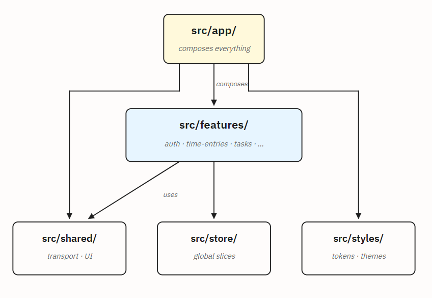
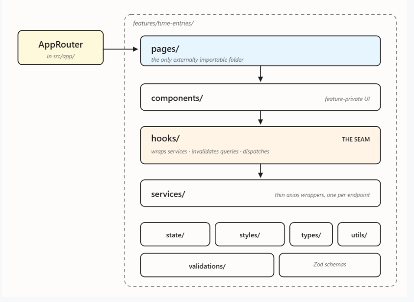
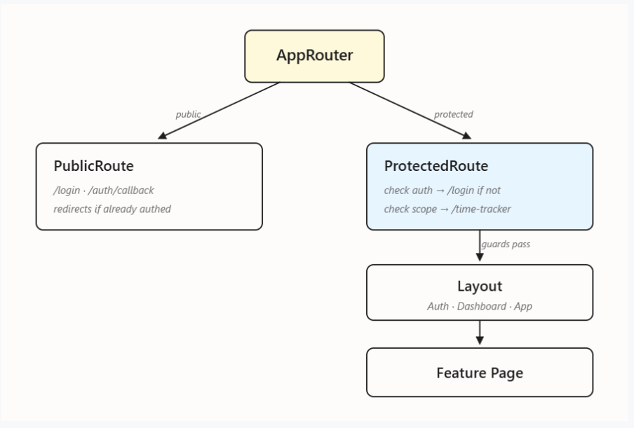
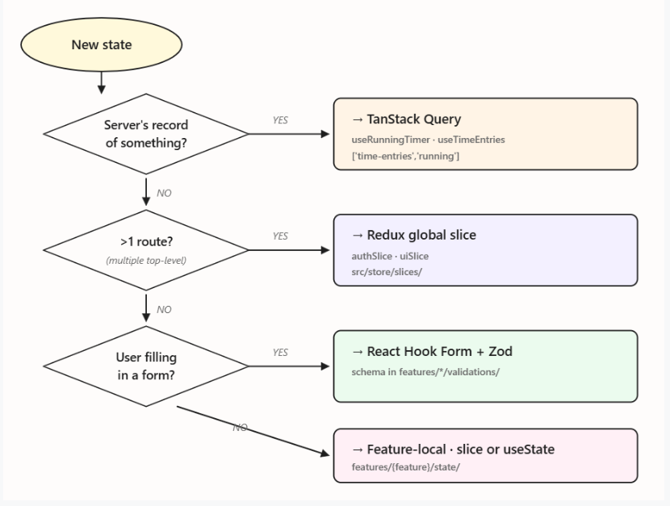
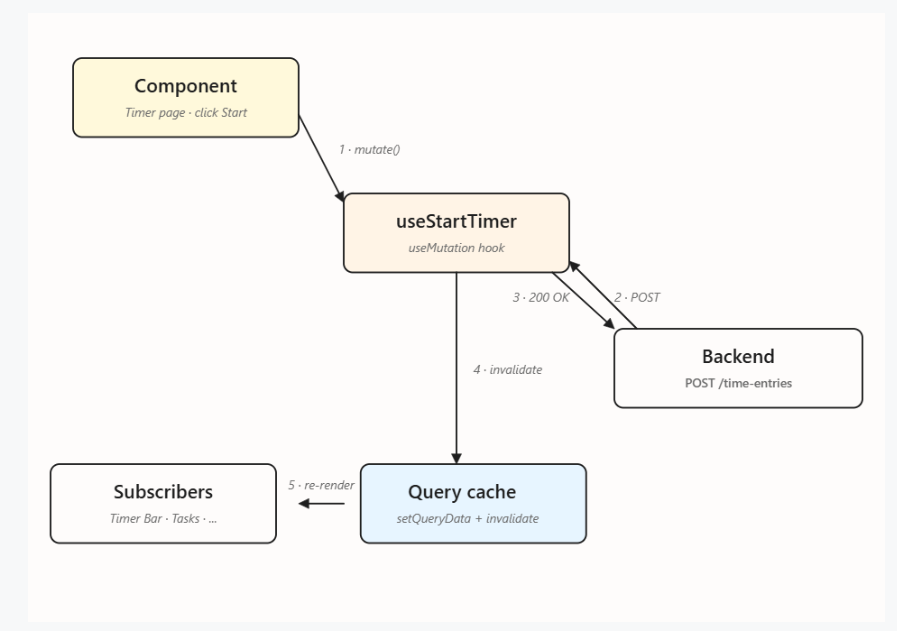
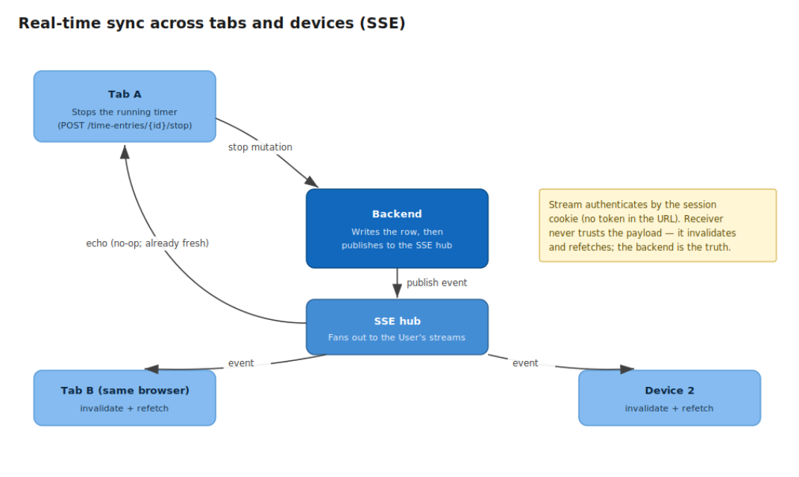

# ADR-005: Frontend Architecture

| Field | Value |
|---|---|
| **Status** | Proposed |
| **Date** | 27-05-2026 |
| **Revised** | 10-06-2026 |
| **Deciders** | Subham Panda, Mohammed Siddique M, Aswath Ravi |
| **Depends on** | ADR-001 (Domain Glossary), ADR-003 (Database Schema), ADR-004 (System Architecture), ADR-011 (Frontend Auth, BFF) |
| **Superseded by** | None |

---

## Context

The frontend has two concerns that were previously documented separately: **where code lives** and **where state lives** . They are not independent — state is hosted by modules, and the rules that govern one constrain the other.

This document replaces both with a single ADR so the two views stay in sync, and adds an explicit synthesis section (*Where State Lives in the Module Tree*) showing which folder hosts which kind of state.

All domain terminology in this document follows ADR-001 exactly — **User**, **Time Entry**, **Running Timer**, **Manual Entry**, **Work Note**, **Task**, **Project**, **Assignment**, **Project Manager**, **Auth Provider**. No new domain terms are introduced. The one shorthand used in code (`useStartTimer` / `useStopTimer`) is justified in *Naming & New Terms* below.

---

## Decision

The frontend uses a **feature-based module architecture** under `src/` with strict one-way dependencies, and a **four-category state model** where each category has exactly one home. The two are bound by a shared structural rule: every Time Entry mutation, every Project read, every Task list refresh flows through one feature module's `hooks/` folder — the single seam between UI components and data.

---

## Module Map

Five top-level modules under `src/`, plus `assets/`. Dependencies flow downward only.



| Module | Purpose | May import from |
|---|---|---|
| `src/app/` | Bootstrap, providers, router, layouts. | `features/`, `shared/`, `store/`, `styles/` |
| `src/features/` | One folder per feature (`auth`, `time-entries`, `tasks`, `projects`, …). | `shared/`, `store/` |
| `src/shared/` | Axios client, SSE client, reusable UI, generic hooks, query keys. | Nothing project-internal |
| `src/store/` | Redux store setup, root reducer, two global slices. | `shared/` (types only) |
| `src/styles/` | SCSS abstracts, theme tokens, base. | Nothing |

Tests live in `tests/`, structured by test type (`unit/`, `integration/`, `e2e/`), not by feature.

---

## Feature Module Shape

Every feature module has the same internal shape. The path tells you the role.



Full folder shape:

```
features/{feature}/
├── pages/          — route entries; the only externally importable folder
├── components/     — feature-private UI
├── hooks/          — the seam: TanStack Query hooks + slice dispatchers
├── services/       — thin axios wrappers, one function per endpoint
├── state/          — feature-scoped Redux slice + selectors
├── styles/         — *.module.scss
├── types/          — feature TypeScript types
├── validations/    — Zod schemas
└── utils/          — pure helpers
```

Three rules govern this shape:

1. **No barrel files inside a feature.** Imports use full paths so the import graph is greppable.
2. **`pages/` is the only externally importable folder** (consumed by `AppRouter`). Everything else is feature-private.
3. **`hooks/` is the single seam between UI and data.** Components never call services directly — they call a hook, which wraps the service in `useMutation` and handles invalidation, slice dispatch, and snackbar feedback.

Initial features: `auth`, `time-entries`, `tasks`. Subsequent features (`projects`, `assignments`, `reports`, `admin`) follow the same shape.

> The feature folder is named `time-entries` — matching ADR-001's canonical API path. Hook names use `Timer` as a verb-target shorthand; see *Naming & New Terms* below.

---

## Routing & Layouts

The router is one component (`AppRouter`) with two guards.



| Guard | Behaviour |
|---|---|
| `PublicRoute` | Wraps `/login`, `/auth/callback`. Redirects to `/time-tracker` if the User is already authenticated. |
| `ProtectedRoute` | Wraps everything else. Redirects to `/login` if unauthenticated. Checks the required scope against the User's `scopes[]` from ADR-001's RBAC. Missing scope → redirect to `/time-tracker` with a snackbar. |

Scope checks happen **at the guard, never inside a page**. A page that mounts is guaranteed the User has the required scope, so pages contain no `if (hasScope)` branching.

### Layouts

| Layout | Used for |
|---|---|
| `AuthLayout` | `/login`, `/auth/callback` |
| `DashboardLayout` | Authenticated routes. Contains the always-on Running Timer strip in the top bar. |
| `AppLayout` | `/admin/*` — same top bar, full-bleed body for dense admin tables. |

The Running Timer strip lives in `DashboardLayout`'s top bar and is the only place outside `features/time-entries/pages/` where a `features/time-entries/` component is mounted. This is a deliberate, documented exception to the "feature components are feature-private" rule.

---

## State Categories

State falls into four categories. Each has exactly one home.

| Category | Tool | Lives in | Examples |
|---|---|---|---|
| **Server state** | TanStack React Query | Query cache (in memory) | `['time-entries','running']`, `['tasks','list']`, `['users','me']` |
| **Global UI state** | Redux Toolkit | `src/store/slices/` | `auth` (User, scopes, session state — no token); `ui` (theme, snackbar queue) |
| **Feature-local UI state** | Redux slice or `useState` | `features/{feature}/state/` or component | Selected Task before start; dialog open; selected row |
| **Form state** | React Hook Form + Zod | Form component (state); `features/{feature}/validations/` (schema) | Login form; Manual Entry; edit dialog |

The two global Redux slices are `auth` and `ui`. New global slices need explicit justification.

---

## The Decision Rule

Three questions decide where a new piece of state goes. First "yes" wins.



1. **Is this the server's record of something?** → Server state (TanStack Query).
2. **Is this UI state used in more than one route?** → Global Redux slice.
3. **Is the User filling in a form?** → React Hook Form + Zod.

Otherwise, it is feature-local: a feature slice if multiple components within the feature read it, `useState` if only one does.

> The Running Timer is **server state**, not Redux. The always-on Running Timer strip in `DashboardLayout` and the `/time-tracker` page both read the `['time-entries', 'running']` query, so they cannot diverge.

---

## Where State Lives in the Module Tree

The bridge between the module structure (*Module Map*, *Feature Module Shape*, *Routing & Layouts*) and the state model (*State Categories*, *The Decision Rule*): a single map showing which folder hosts which state category.

```
src/
├── store/slices/                  [GLOBAL UI STATE]
│   ├── authSlice.ts               — User, scopes, session state (no token)
│   └── uiSlice.ts                 — theme, snackbar queue
│
├── shared/
│   ├── api/                       — axios client (REST transport, cookie + CSRF)
│   ├── sse/                       — SSE client (sync transport, cookie-authenticated)
│   └── constants/queryKeys.ts     — addresses, not state
│
├── app/providers/                 [INFRASTRUCTURE]
│   ├── ReduxProvider              — makes global state available below
│   └── QueryProvider              — makes Query cache available below
│
└── features/{feature}/
    ├── pages/                     — route entry (reads from all categories)
    ├── components/                [FORM STATE via useForm()]
    ├── hooks/                     [SERVER STATE owner]
    ├── services/                  — axios wrappers (server-state access)
    ├── state/                     [FEATURE-LOCAL UI STATE]
    └── validations/               — Zod schemas (form-state shape)
```

Reading this map for concrete cases:

- A new Time Entry mutation lives in `features/time-entries/hooks/useStartTimer.ts`.
- The User profile, scopes, and session state live in `src/store/slices/authSlice.ts` — there is no token to store; the session is an httpOnly cookie the app cannot read.
- The "selected Task before starting a timer" lives in `features/time-entries/state/timerSlice.ts`.
- The Manual Entry form's validation schema lives in `features/time-entries/validations/manualEntry.schema.ts`.
- The transport layer (axios, SSE) is shared infrastructure, not state.

---

## Bootstrap & Provider Chain

The order of providers is fixed; each provider depends on the ones above it.

```
main.tsx
└── <ReduxProvider>             — store available to everything below
    └── <QueryProvider>         — QueryClient available to everything below
        └── <ThemeProvider>     — reads theme from ui slice
            └── <SnackbarProvider>
                └── <AppRouter>
                    └── PublicRoute | ProtectedRoute
                        └── Layout (Auth | Dashboard | App)
                            └── Feature Page
```

Two state-relevant things happen before first paint:

1. **Synchronous read of `localStorage` — theme only.** The theme preference is read in `main.tsx` to initialise the `ui` slice, and the `<html data-theme>` attribute is set before paint to avoid a theme flash. There is no token to read: the session is an httpOnly cookie the app cannot access, so the `auth` slice initialises to the `checking` state and is resolved by the backend, not by client storage.
2. **Session verification.** After mount, `loadProfile()` calls `GET /auth/me`; the session cookie rides along automatically. On 200, the User's profile and scopes hydrate and the slice moves to `signed_in`; the SSE connection opens (also cookie-authenticated). On 401, `forceSignOut()` resets the slice to `signed_out` and redirects to `/login`.

Only one piece of state survives a reload in client storage: the theme. The auth session lives in the cookie (opaque to the app) and is re-verified every load; the Query cache starts empty on every page load.

---

## Server State Lifecycle

The canonical mutation flow, illustrated with starting a Running Timer.



1. The User clicks **Start** on a Task. The page component calls `startTimer.mutate({ taskId })` from `useStartTimer()`.
2. The hook's `mutationFn` calls `timeEntriesService.start()`, which posts to `POST /time-entries`.
3. The backend creates a Time Entry with `start_at` and `end_at = NULL` — a Running Timer per ADR-001. Per ADR-003, `duration_seconds` is server-computed and not present in the request payload.
4. The hook's `onSuccess` writes the canonical value: `qc.setQueryData(['time-entries', 'running'], newEntry)`. The Running Timer strip updates instantly.
5. `onSuccess` then invalidates dependent queries: `qc.invalidateQueries(['time-entries'])` and `qc.invalidateQueries(['tasks'])`.
6. Mounted observers refetch in the background. Unmounted observers stay stale and pick up fresh data on next mount.
7. Subscribers re-render. The component never wrote to the cache itself.

---

## Real-Time Sync (SSE)

State changes in one client need to appear in every other client logged into the same User account. The transport is a one-way server-push **Server-Sent Events (SSE)** stream, opened with `EventSource` after `/auth/me` returns 200 (see *Bootstrap & Provider Chain*). The stream's GET carries the session cookie automatically, so it authenticates exactly like every other request — no token in the URL, no separate handshake.



1. The User stops the Running Timer in Tab A. The mutation hits `POST /time-entries/{id}/stop`.
2. The backend writes the row, then publishes a domain event onto the SSE hub.
3. The hub fans out the event to every connected stream for that User — Tab A's own stream included.
4. In parallel, Tab A's local `onSuccess` invalidates immediately (fast path). The SSE echo arrives later and is a no-op because the cache is already fresh.
5. Tab B (same browser) and Device 2 (different browser/laptop) receive the same event. Their handler invokes `qc.invalidateQueries(['time-entries'])` and dependent keys. Refetches fire and subscribers re-render.

The receiver never trusts the event payload — it invalidates and refetches. The backend stays the source of truth; the event is a hint.

`EventSource` reconnects automatically, so the client carries no backoff logic of its own. Connection state still surfaces in the UI: a green **Live** dot when connected, an amber **Reconnecting…** banner while `EventSource` is retrying. On reconnect, a single sweep `qc.invalidateQueries()` refreshes anything that may have changed during the gap. If the session has expired or been revoked while the stream was open, the backend closes it; the reconnect attempt resolves to a 401 and the app forces sign-out — the stream is never an independent auth path.

---

## Naming & New Terms

All terminology follows ADR-001. Specifically:

- API paths use plural kebab-case: `/time-entries`, `/projects`, `/project-managers`.
- Query keys mirror the API path: `['time-entries', 'running']`, `['tasks', 'list', filters]`, `['users', 'me']`.
- Components and pages use the canonical noun: `RunningTimerStrip`, `TimeEntryListPage`, `ManualEntryDialog`.

### One shorthand: `useStartTimer` / `useStopTimer`

ADR-001 defines **Running Timer** as "a Time Entry where `end_at IS NULL`." The verbs *Start* and *Stop* act specifically on that Running Timer. `useStartTimer` means "start a Running Timer" — it is the **action on a defined ADR-001 noun, not a new term**. This shorthand is used only in hook names; the underlying entity is always called Time Entry in API paths, query keys, and types.

### Framework terms used in this document

The terms *slice*, *query*, *mutation*, *provider*, *hook*, and *seam* come from the React / Redux Toolkit / TanStack Query ecosystems. They describe code structure, not the Time Entry domain. They are not subject to ADR-001's "Do Not Use" list.

---

## Dependency Rules

Enforced by ESLint's `no-restricted-imports`. Violations block merge.

| Rule | Rationale |
|---|---|
| `features/X` may not import from `features/Y` | Feature isolation. Shared logic moves to `src/shared/`. |
| `src/shared/` may not import from `src/features/` | Shared is a leaf module. |
| `src/store/` may not import from `src/features/` | The global store is owned by `app/`; feature-scoped state lives in feature slices. |
| `src/styles/` may not import from anything project-internal | SCSS is the foundation. |
| `src/app/` may import from anywhere | The app layer composes everything. |
| No relative imports beyond `..` | Use the `@/` alias for cross-module imports. |

---

## Anti-Patterns

These are forbidden. ESLint catches some; code review catches the rest.

| Anti-pattern | What instead |
|---|---|
| Mirroring server data into Redux ("the Time Entries list slice") | Read the query in the consuming component. |
| Putting form state in Redux | React Hook Form, local to the form component. |
| Reading `localStorage` directly from a component | Read from the slice via `useAppSelector`. |
| Inline selectors (`useAppSelector(s => s.auth.user?.role)`) | Named selectors imported from the slice file. |
| Putting URL state in Redux | React Router's `useLocation`, `useSearchParams`. |
| `useEffect` to sync two slices | Compute it with a `createSelector`. |
| Manual `queryClient.setQueryData` outside an optimistic mutation | Invalidate and let Query refetch. |
| Sending `duration_seconds` from the client | Per ADR-003, `duration_seconds` is server-computed. Mutation hooks strip the field defensively before sending. |

---

## Consequences

**Positive**

- One document covers both module structure and state placement. The synthesis section (*Where State Lives in the Module Tree*) is the bridge previous documents could not provide.
- Domain terminology aligns with ADR-001 throughout. No drift between API paths, query keys, hooks, and components.
- ESLint dependency rules catch architectural drift at PR time.
- The Running Timer is unambiguously server state in one document — the most common confusion in time-tracking apps (treating it as a Redux flag) is closed.

**Negative**

- Larger single document. Mitigated by the four-part structure (Structure / State / Synthesis / Runtime) and the per-section diagrams.
- Two state libraries (Redux Toolkit + TanStack Query) require two mental models. Mitigated by the Decision Rule — developers rarely choose; the rule chooses for them.
- The Running Timer strip exception (a `features/time-entries/` component mounted inside a layout) remains the only documented break in feature isolation. Further exceptions require an ADR revision.

**Neutral**

- Adding a new global slice requires a deliberate, reviewable change to `src/store/index.ts`. Adding a feature slice is local to the feature.
- The layer model from ADR-004 was descriptive (not enforced); the *Dependency Rules* table above is what the lint actually checks. This document drops the layer model section in favour of the rules table — same intent, less duplication.

---

## References

- **ADR-001** — Domain Glossary & Access Control Policy (canonical terminology, RBAC, report catalogue)
- **ADR-003** — Database Schema V2 (`duration_seconds` server-computed; `start_at` / `end_at` as source of truth)
- **ADR-004** — System Architecture (BFF model, cookie session, SSE channel)
- **ADR-011** — Frontend Authentication Implementation (BFF) — the auth vertical this architecture hosts
- TanStack Query — `invalidateQueries`, `setQueryData`, query key semantics
- React Hook Form — `setError`, `handleSubmit`

---

## Change Log

| Date | Change |
|---|---|
| 27-05-2026 | Initial version: feature-based module architecture and four-category state model. |
| 10-06-2026 | BFF authentication revision. The `auth` slice no longer holds a token (session is an httpOnly cookie). Bootstrap reads only the theme from `localStorage`; the auth session is re-verified via `/auth/me` every load rather than rehydrated from storage. Replaced the WebSocket real-time channel with a cookie-authenticated SSE stream (`shared/sse/`, `EventSource`, native reconnect). No change to the module map, feature shape, routing guards, or the state-placement decision rule. |