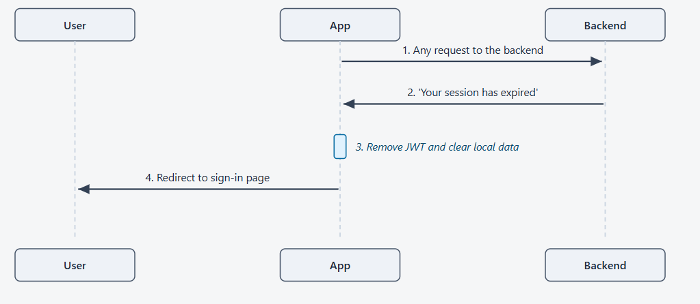

# ADR-006: Authentication Flow

| Field | Value |
|---|---|
| **Status** | Proposed |
| **Date** | 22-05-2026 |
| **Deciders** | Subham Panda, Mohammed Siddique M and Aswath Ravi |
| **Related documents** | ADR-004 (System Architecture), ADR-001 (Domain Glossary), ADR-003 (Database Schema) |

---

## Decision

Users sign in with Microsoft (SSO is the only path). Once signed in, the app gets a short-lived session token that it sends with every request. The token lasts thirty minutes; after that, the user signs in again. There is no "remember me forever" — every session is fresh and bounded.

Users do not self-onboard. An administrator pre-creates the user record in the app before that person can sign in. Microsoft's identity is bound to the record on the user's first successful sign-in.

This ADR covers two related decisions: how users sign in (sections 1–5) and how users come to exist in the system (section 6).

---

## 1. Signing in with Microsoft

This is the primary way users sign in. When the user clicks **Sign in with Soliton**, the app sends them to Microsoft's sign-in page. Microsoft handles passwords, multi-factor authentication, and any company policies. Once Microsoft confirms the user is who they say they are, the user is sent back to our app with proof of identity. The app passes that proof to our backend, which checks it against our user database and returns a session token. The user then sees the dashboard.

**What this gives the customer:**

- **No password management for users.** Soliton accounts use whatever Microsoft is already configured to require — single sign-on, multi-factor, conditional access policies, everything.
- **No password storage on our side.** We never see the user's Microsoft password, and we don't store one ourselves.
- **Users who aren't on Soliton's Microsoft tenant cannot sign in.** Even if a user has a valid Microsoft account elsewhere, our backend rejects identity tokens that came from the wrong tenant.

**If something goes wrong:**

| Situation | What the user sees |
|---|---|
| User cancels at Microsoft | Returned to the sign-in page with no error |
| Microsoft confirms identity but the user isn't in our system | "Your account isn't enabled. Contact your administrator." |
| User's account is archived | "This account has been archived." |
| Network or service error | "We couldn't sign you in. Please try again." |

---

## 2. Returning to the app

When a user comes back to the app — closing and reopening the browser, refreshing the page, or clicking a link from email — we don't want to make them sign in again if their session is still valid. The app remembers the session token from last time and asks the backend "is this still valid?" before showing the dashboard.

**What the user experiences:**

- If the session is still valid (less than 30 minutes since last sign-in), they go straight to the dashboard with no interruption.
- If the session has expired or the user's account status changed (e.g. an administrator archived them), they're sent back to the sign-in page.
- While the app is checking with the backend (usually well under a second), the user sees a loading screen — never an empty dashboard, never an unnecessary sign-in page.

---

## 3. Signing out

When the user clicks **Sign out**, the app immediately clears their session locally and sends them to the sign-in page. In the background, we record the sign-out event for our audit trail.

**Two important properties:**

- **Sign-out never makes the user wait.** Even if the network is slow or the backend is busy, the user sees the sign-in page instantly. The audit entry happens in the background and doesn't block the experience.
- **The audit trail records every sign-out.** Administrators can see who signed out, from where, and when.

---

## 4. Session expires after 30 minutes

Sessions are intentionally short — thirty minutes after sign-in, the session expires. The next time the user takes any action that talks to the backend, they're informed their session has expired and sent back to the sign-in page to start fresh.

**Why thirty minutes:**

- A short session limits exposure if a user leaves a computer unlocked or if their session token is ever compromised.
- For Microsoft sign-in users, re-signing in usually doesn't require typing a password — Microsoft remembers the recent sign-in and confirms with a single click.
- This is configurable via the `JWT_TTL_SECONDS` environment variable. If user feedback shows 30 minutes is painful, it can be extended without any architectural changes. The architectural property is "short-lived stateless tokens with no server-side revocation" — the specific duration is operational policy.

---

## 5. The three states a session can be in

At any given moment, a user's session is in one of three states. Understanding these three states explains every UI behavior in the app.

| State | What it means |
|---|---|
| **Signed out** | No session. The user sees the sign-in page. |
| **Checking** | The app has a session token but is asking the backend if it's still valid. The user sees a brief loading screen. |
| **Signed in** | The session is confirmed valid. The user can use the app. |

The **Checking** state is the reason returning users don't see a flash of the sign-in page when they reload — the app holds the loading screen until it knows for sure whether the session is still good.

---

## 6. How users come to exist in the system

Microsoft tells us who someone *is*. It does not tell us whether that person is allowed to use the Soliton Timer App, nor what role they should have. Those are our decisions, and they need a deliberate process.

We use a two-step onboarding pattern:

1. **IT adds the person to Azure AD** as part of their normal joiner process. This gives the person a Microsoft identity and gets them into Soliton's tenant.
2. **An administrator pre-creates the user in the timer app** — email, display name, and role (User, Report Viewer, Manager, or Administrator per ADR-001). This creates a row in the `users` table with the email set, the role assigned, and the `microsoft_oid` field empty.

The first time the user clicks **Sign in with Soliton**, the backend receives Microsoft's identity token, finds the pre-created row by email, fills in the `microsoft_oid` from the token, and from that point on the user is bound. All future sign-ins match on `microsoft_oid` directly, not email.

### Why bind on `microsoft_oid` and not email

The `microsoft_oid` is Microsoft's permanent unique identifier for a user account. It does not change when the person's email changes (marriage, rebranding, internal transfers). It is also cryptographically tied to the identity token Microsoft issues, so it cannot be spoofed by anyone holding the same email on a different tenant.

Email is used only for the initial lookup. After binding, it becomes a display attribute.

### What happens if someone tries to sign in without being pre-created

The backend returns an `unknown_user` error and the user sees **"Your account isn't enabled. Contact your administrator."** — the same error already covered in section 1. The failure mode is clean: the user knows what to do, and an administrator adds them in the app in about 30 seconds.

### Why we don't auto-create on first sign-in

The most convenient alternative would be to create a user row automatically the first time someone with a valid Soliton Microsoft account visits the app. We deliberately chose not to do that:

- **Anyone in Soliton's tenant could give themselves access.** Contractors, interns who haven't been provisioned for this tool, employees from other business units — all of them have valid Microsoft accounts. The timer app contains timesheet data and administrative controls; self-onboarding is too permissive.
- **Our role model lives in our database, not in Azure AD.** Even if a user is auto-created, an administrator still has to assign a role. Two-step onboarding is more honest about this reality than a flow that pretends to be automatic but actually requires manual follow-up.

### Why we don't sync from Azure AD groups

Full synchronisation from Azure AD groups (add to group → appears in app within minutes) is the third pattern we considered. It would be the cleanest long-term answer, but the cost is wrong for V1:

- We would need group-to-role mapping (e.g. `timer-app-admins` AD group → `administrator` role in our DB). This doubles the configuration surface — every role change has to happen in two places.
- It requires either SCIM provisioning or a background reconciliation job. Both are infrastructure work that doesn't pay back at our scale.

If Soliton grows past a few hundred users or wants HR to drive onboarding directly, this pattern is worth revisiting.

### Offboarding

When a user leaves Soliton or no longer needs timer app access, an administrator archives the user in the app (status flips to `archived`). The Azure AD account is unaffected — the user may still need it for other tools.

Archived users are rejected at sign-in with **"This account has been archived"** (already covered in section 1). The user record itself is retained for the audit trail; ADR-003 disallows physical deletion of `users` rows because they are referenced by `time_entries`, `audit_logs`, and similar.

---

## Security summary

| Property | How it's enforced |
|---|---|
| Soliton-only access | Identity tokens from any Microsoft tenant other than Soliton's are rejected |
| Short session windows | Thirty-minute session tokens; no long-lived "remember me" |
| No self-onboarding | A user must be pre-created by an administrator before they can sign in, even with a valid Soliton Microsoft account |
| Permanent identity binding | First sign-in binds Microsoft's `oid` to the user record; subsequent lookups use `oid`, not email |
| Full audit trail | Every sign-in attempt, every sign-out, and every administrative user change is recorded |
| Sensitive data never leaks to the client | `microsoft_oid` is never returned in any response |
| Standard libraries handle the hard parts | Microsoft's official authentication library handles the OAuth protocol; we don't write the security-critical code ourselves |

---

## Consequences

### Positive

- **Single source of truth for identity.** Azure AD owns who people are, what their password is, and what MFA they need.
- **Single source of truth for app access.** Our `users` table owns who is allowed in the timer app and what role they have.
- **Clean offboarding.** Archiving in the app cuts off access without touching Azure AD.
- **No password storage anywhere in our system.** The bcrypt dependency, the local login form, and the rate-limiting logic are all eliminated.

### Negative

- **Two-step onboarding.** A new joiner cannot self-serve. If an administrator hasn't pre-created them in the app, their first sign-in attempt fails. In practice this batches naturally with the joiner paperwork process.
- **No break-glass account.** If Microsoft Entra ID is down, no one can sign in to the timer app, including administrators. This is the trade-off accepted by removing the local fallback path.
- **First-administrator bootstrap requires a seed script.** At go-live there is no administrator in the `users` table, so a one-time seed must run before the first sign-in attempt.

### Neutral

- **The "unknown_user" error is generic.** It tells the user to contact their administrator but does not name them. This is intentional (avoids leaking who the administrators are) but may surface as a support ticket the first time someone hits it.

---

## Open questions

| # | Question | Status |
|---|---|---|
| 1 | What is the bulk-import path for the initial seed at go-live? Likely a one-time CSV import or seed script — to be agreed with Soliton operations. | Open |
| 2 | What happens if a user's Azure AD email changes after binding? Display name and email should refresh from the latest sign-in; `microsoft_oid` stays the same. | Open — needs explicit handler logic |
| 3 | If Microsoft Entra ID has an extended outage, what is Soliton's recovery posture for the timer app? | Open — needs operations input |

---

## Related documents

- **ADR-001— System Architecture.** The overall system this auth flow lives in: client app, backend service, database, and Microsoft as the identity provider.
- **ADR-001 — Domain Glossary and Access Control Policy.** Who the users are, what roles exist (User, Report Viewer, Manager, Administrator), and what each role is allowed to do.
- **ADR-003 — Database Schema.** The tables this flow touches: `users` (account records, including the `microsoft_oid` field that gets bound on first sign-in), `auth_logs` (the sign-in audit trail), `audit_logs` (administrative changes), and the role and permission tables.